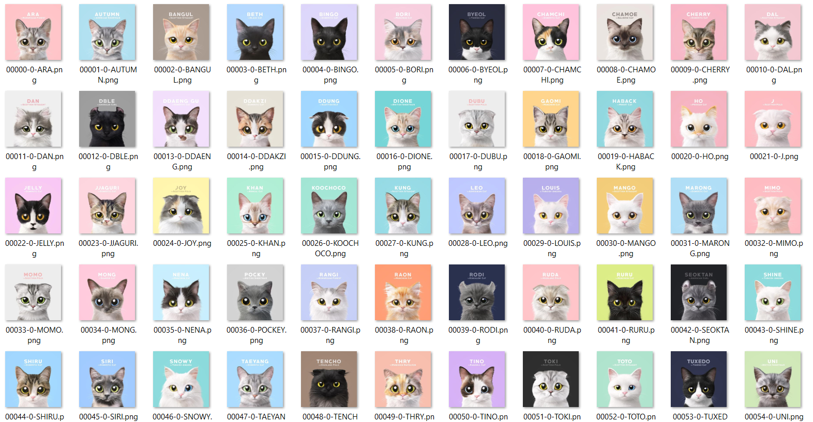

#### Training exercise
I collected these cat avatar pictures from the Internet. I really like these cat avatars. And I only use these pictures for learning machine-learning. **After generating these pictures, I already delete the training model and all the generated pictures.** I am very grateful to the original authors who created these avatars, without their efforts there would be no such cat avatars style.  
  
The training data is this:  
  
  
Then, we choose the parameters and train the model. For every 500 steps, print out the loss function and create a new picture generated by the model. And finally choose the best model.  
  
So, there are some examples, the model generate these pictures from different prompts. But these cats all have the original avatars' style. This is just for fun and I have deleted all the generated pictures.  
  
I have deleted all the pictures and models. And thanks again for the authors who created these pictures.